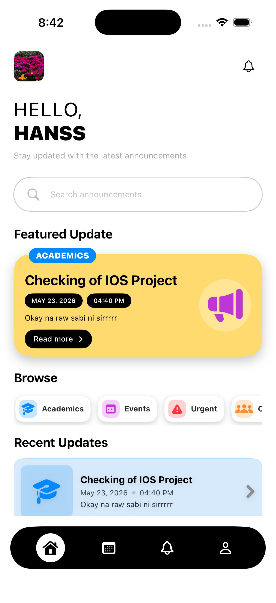

# 📢 Acadvisory - Announcement App




## 📖 About

Acadvisory is a mobile announcement application designed for **Our Lady of Fatima University Antipolo Campus**. The application provides a centralized platform where students can easily view campus announcements, event schedules, recent updates, and important notifications using their mobile devices.

The main goal of Acadvisory is to improve the way school announcements are shared and accessed. Instead of relying only on group chats, manual posting, or scattered information, the app allows users to receive and check announcements in a more organized and convenient way.

The system includes student and admin access. Students can view announcements, browse categories, check event dates and times, and mark notifications as read. Administrators can create, edit, delete, and manage announcements through the app.

---

## 🎓 Story

I built Acadvisory as a mobile application project connected to Our Lady of Fatima University Antipolo Campus. The objective of this project was to create a useful campus-based announcement system that helps students stay updated with important school information.

Through this project, I was able to apply my skills in mobile app development, user interface design, Firebase authentication, Firestore database integration, and role-based access control. The project also helped me improve my problem-solving and debugging skills while building an application that can be useful in a real school environment.

---

## 🚀 Live Demo

This project is currently designed as a mobile application and can be run using Xcode or a compatible iOS simulator.

> ⚠️ **Note:** The application requires Firebase configuration through `GoogleService-Info.plist` in order to connect properly to Firebase Authentication and Firestore Database.

---

## ✨ Key Features

### 👤 User Features

- **User Registration and Login**  
  Allows students/users to create an account and securely log in using their email and password.

- **Announcement Dashboard**  
  Displays featured announcements, recent updates, categories, and important campus information.

- **Browse by Category**  
  Users can browse announcements by categories such as Academics, Events, Urgent, Organization, and Campus Updates.

- **Calendar / Announcement View**  
  Allows users to view announcements with posted date, event date, event time, category, and full announcement details.

- **Notification System**  
  Notifies students when new announcements are posted.

- **Read Notification Status**  
  Students can mark announcements as read to keep track of updates they have already checked.

- **User Profile**  
  Displays the user’s profile information, including name, role, and profile picture.

---

### 🛡️ Admin Features

- **Admin Login**  
  Allows authorized admin users to access announcement management features.

- **Create Announcement**  
  Admins can create and publish announcements by entering the announcement title, date of event, time of event, category, and details.

- **Edit Announcement**  
  Admins can update existing announcements when changes are needed.

- **Delete Announcement**  
  Admins can remove announcements that are no longer needed.

- **Announcement History**  
  Admins can view the history of announcement edits and deletions for tracking and record purposes.

- **Role-Based Access**  
  Admin-only features are hidden from student accounts to prevent unauthorized actions.

---

## 🛠 Tech Stack

### Mobile App

- **Swift / SwiftUI** – Used to build the iOS mobile application interface and functionality.
- **Xcode** – Main development environment used for creating and running the iOS app.

### Backend & Database

- **Firebase Authentication** – Handles user registration and login.
- **Cloud Firestore** – Stores announcements, users, notification read status, and announcement history.
- **Firebase Core** – Connects the iOS application to the Firebase project.

### Tools

- **Git / GitHub** – Version control and project repository management.
- **Firebase Console** – Database, authentication, and backend management.
- **iOS Simulator** – Used for testing the application.

---

## 📂 Project Structure

This repository contains the Swift/Xcode version of the Acadvisory Announcement App.

```text
├── Acadvisory/
│   ├── AcadvisoryApp.swift          # Main app entry point and Firebase initialization
│   ├── ContentView.swift            # Login and sign-up screens
│   ├── DashboardViews.swift         # Home dashboard and announcement list UI
│   ├── CalendarViews.swift          # Calendar and announcement detail screens
│   ├── NewAnnouncementView.swift    # Admin create/edit announcement screen
│   ├── ProfileViews.swift           # User profile and admin history screen
│   ├── SharedViews.swift            # Reusable UI components and bottom navigation
│   ├── Services.swift               # Firebase authentication and Firestore logic
│   ├── Models.swift                 # Data models for users, announcements, and history
│   ├── AppTheme.swift               # App colors and theme styling
│   ├── Assets.xcassets              # App images and assets
│   └── GoogleService-Info.plist     # Firebase iOS configuration file
│
└── README.md                        # Project documentation
